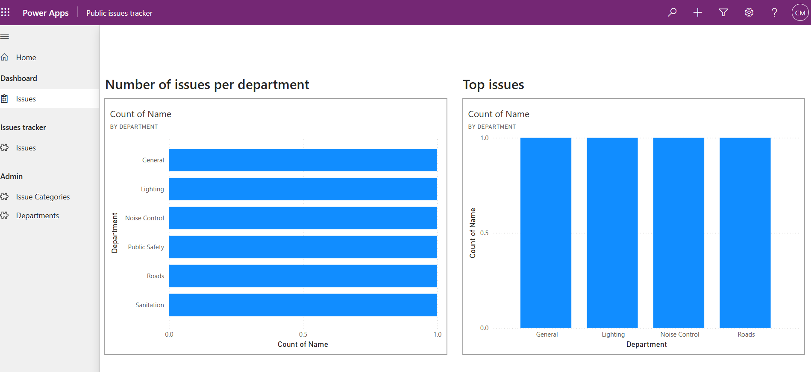
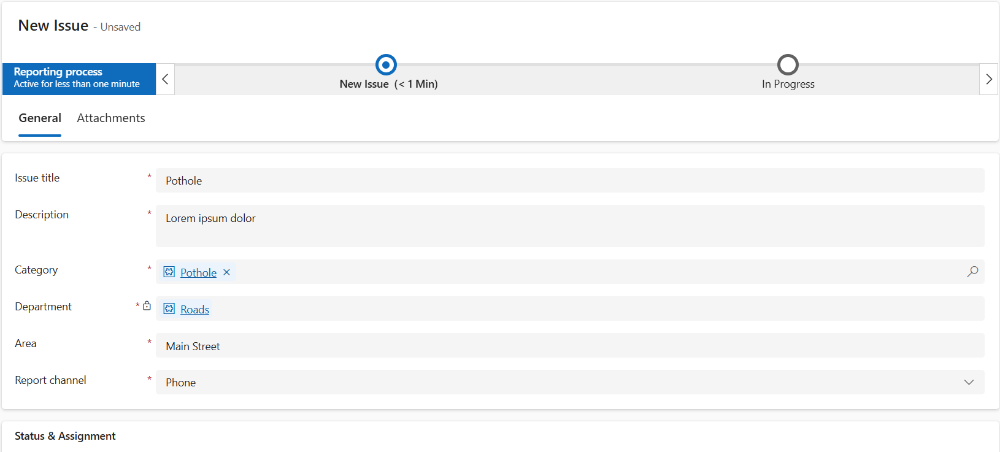
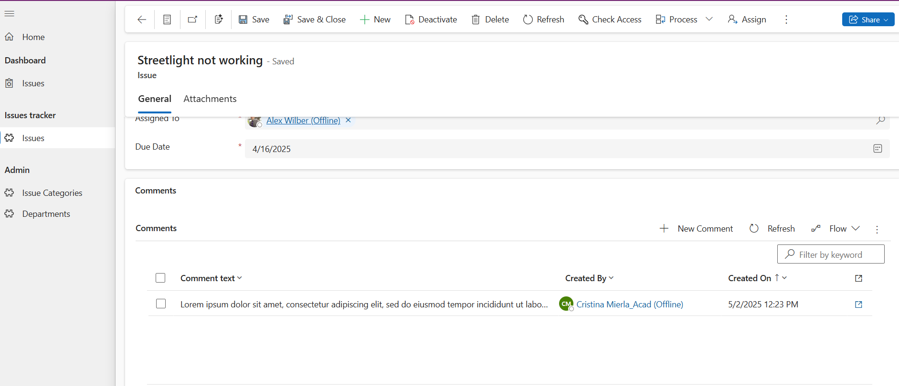
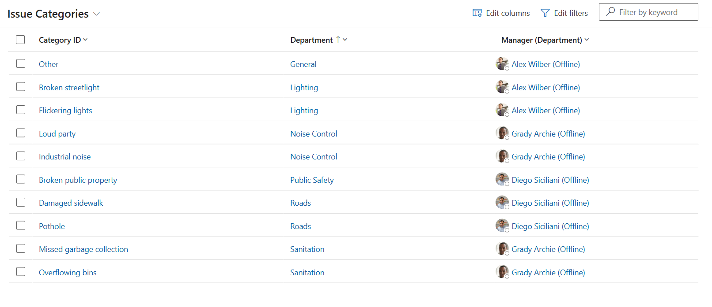

# Public Issues Tracker - Model-Driven Power Platform App

## Overview

**Public Issues Tracker** is a Model-Driven Power Apps application designed to help operators register and manage issues related to public infrastructure or services. The solution provides a structured workflow, data governance, and insightful analytics to support better decision-making across departments.

---

## Features

### 🎯 Issue Management

- Operators can log issues that relate to the public domain (e.g., broken streetlights, potholes, vandalism).
- Each issue goes through a predefined **Business Process Flow** with the following stages:
  - `New`
  - `In Progress`
  - `Finish`

### 🔐 Security Roles

The solution includes three distinct security roles with varying levels of access:
- **Operator** – can create and track issues.
- **Department Responsible** – can view and manage issues within their department only.
- **Manager** – has full visibility and oversight across departments.

### 🧠 Intelligent Field Automation

- A custom **JavaScript function** automatically fills the **Department** field based on the selected **Issue Category**, reducing human error and improving data consistency.

### 📊 Dashboards and Reporting

The homepage features an integrated **Power BI dashboard** displaying:
- Number of issues per department.
- Top 4 issues by department.

### 🧭 Sitemap Navigation

The app's sitemap includes quick access to:
- **Issue Management**
- **Issue Categories** (administered via a lookup table)
- **Departments** (maintained via a related table)

### ⚙️ Automation

A scheduled **Power Automate flow** is included, which:
- Automatically updates the status of issues whose due date has passed.
- Reassigns the issue to the corresponding department manager.

---

## Screenshots

### 📊 Power BI Dashboard on Homepage

*Displays the number of issues per department and the top 4 issues by department.*

### 📝 Issue Form

*The form used by operators to log and manage issues.*

### 💬 Comments Section in Issue Form

*The comments section allows users to add notes and updates about the issue.*

### 🗂️ Issue Categories View

*View of the Issue Categories for easy classification and filtering of issues.*

---

## Technologies Used

- Power Apps (Model-Driven)
- Power BI Embedded
- Power Automate (Scheduled Flow)
- Dataverse
- JavaScript (form-level logic)